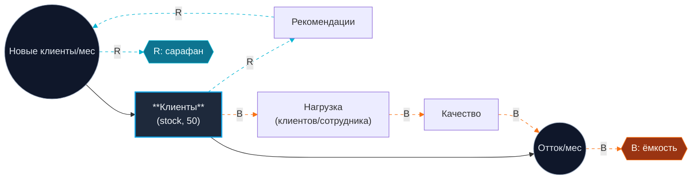
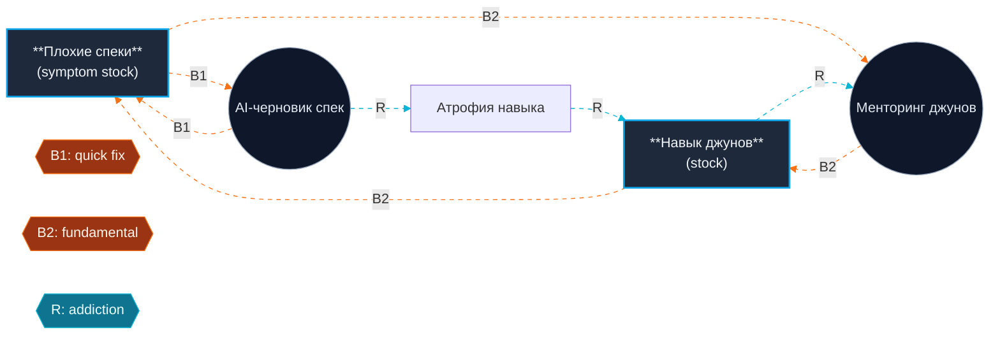
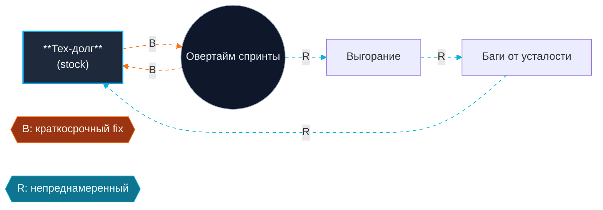

# Mermaid Cheatsheet for Stock-Flow + Archetype Diagrams

This file is INLINED into PROMPT.md. Edit here, then sync into the prompt's `<<<MERMAID_RULES>>>` block.

## Rules of the dialect we use

- Always use `graph LR` (left-to-right). Stock-flow reads better horizontally.
- **Stocks** = rectangles with double border: `Stock["**Customers**<br/>(stock)"]` and `class Stock stock`.
- **Flows** = circles or stadium shapes labeled with rate: `Inflow(("New customers/mo"))` and `class Inflow flow`.
- **Auxiliary variables** (load, quality, capacity) = plain text nodes, no class.
- **Reinforcing loop edges** = dashed, cyan: use `-.->|R: word-of-mouth|` and apply `linkStyle ... stroke:#06b6d4,stroke-dasharray: 5 5`.
- **Balancing loop edges** = dashed, orange: use `-.->|B: capacity|` and apply `linkStyle ... stroke:#f97316,stroke-dasharray: 5 5`.
- **Causal links inside a flow** = solid arrows `-->`.
- Mark loop center with a label node: `R1{{R: word-of-mouth}}` and `B1{{B: capacity}}`. Diamonds with `{{ }}` shape.
- Always include a `classDef` block at the top:

```
classDef stock fill:#1e293b,stroke:#0ea5e9,stroke-width:2px,color:#f1f5f9;
classDef flow fill:#0f172a,stroke:#94a3b8,stroke-width:1px,color:#e2e8f0;
classDef loopR fill:#0e7490,stroke:#06b6d4,color:#ecfeff;
classDef loopB fill:#9a3412,stroke:#f97316,color:#fff7ed;
```

- Every R-loop edge: append `linkStyle N stroke:#06b6d4,stroke-dasharray: 5 5` where N is the 0-indexed edge number.
- Every B-loop edge: append `linkStyle N stroke:#f97316,stroke-dasharray: 5 5`.
- Keep node count <= 10. The diagram should be readable at a glance, not exhaustive.
- Russian labels are fine inside node text. Use `<br/>` for line breaks.

## Worked example 1 - Limits to Growth (Stanislav)



## Worked example 2 - Shifting the Burden (AI drafts specs, junior skill atrophies)



Note: the R-loop here represents the *unintended reinforcing* dependency (atrophy → more reliance on quick fix → more atrophy). It's reinforcing because it compounds, even though every individual edge is "negative." This is the canonical SD convention.

## Worked example 3 - Fixes that Fail (paying down tech debt with overtime)



## What NOT to do

- Don't use `flowchart` keyword - stick with `graph LR`.
- Don't omit the `classDef` block; without it the colors don't render.
- Don't use solid edges for feedback loops - participants must visually see R vs. B at a glance.
- Don't invent stocks the user did not name. If the user only named one stock, the diagram has one stock.
- Don't number `linkStyle` based on the markdown order you wrote - count edges in the order they appear in the diagram (0-indexed).
