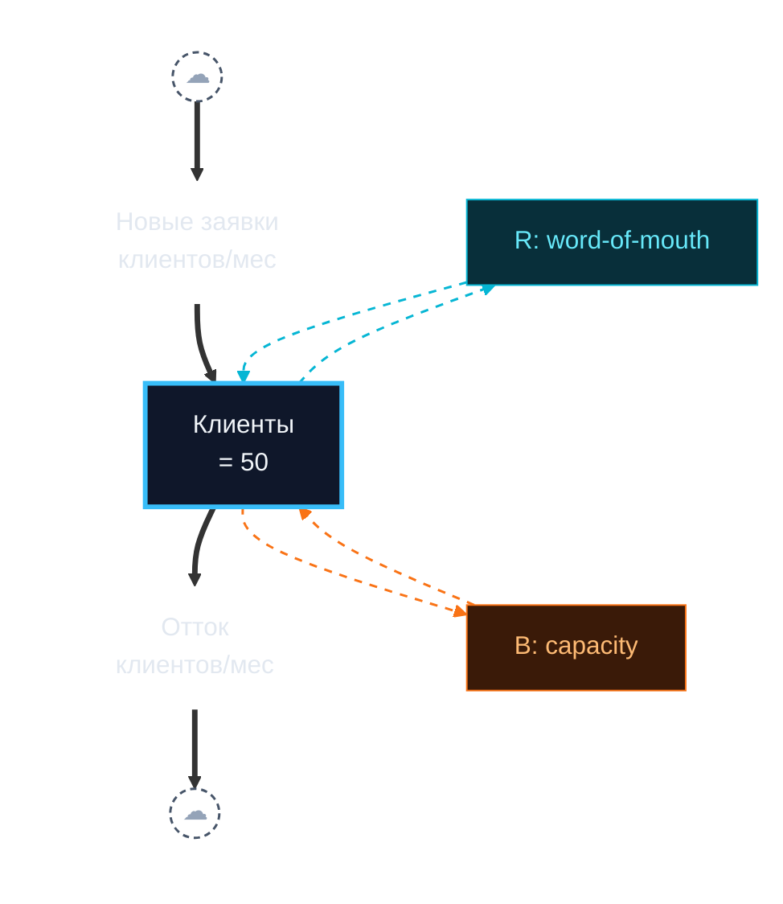

# Mermaid Cheatsheet for Stock-Flow + Archetype Diagrams

This file is INLINED into PROMPT.md. Edit here, then sync into the prompt's `<<<MERMAID_RULES>>>` block.

## Goal

The diagram is **centered on the stock-and-flow pipe**. Loops are **secondary**: each loop is abstracted into a single labeled pill that floats above or below the stock and connects back via short dashed arcs. Auxiliaries (workload, quality, recommendations, etc.) do NOT appear in the diagram — they live as text in §6 Simulation Prep.

We approximate Vensim/Stella high-level views within Mermaid's vocabulary.

## Visual hierarchy

1. **Primary (thick, solid)**: the horizontal pipe `Src ==> In ==> Stock ==> Out ==> Snk`.
2. **Secondary (thin, dashed, colored)**: loop arcs from Stock → loop label pill → Stock.
3. **No auxiliaries** in the diagram itself.

## Rules of the dialect

- Use `flowchart TB` at the top level. The pipe lives inside `subgraph pipe [" "]` with `direction LR`. Loop pills sit OUTSIDE the subgraph, as siblings — Rloop above, Bloop below. This anchors the loops above/below the stock and keeps the pipe horizontal.
- **Source/Sink (cloud)** = `Src(("☁")):::cloud`, `Snk(("☁")):::cloud`. The system boundary on each side of the main pipe.
- **Stocks** = sharp rectangles, thick border: `S["Customers<br/>= 50"]:::stock`. **No** `**bold**` markdown — Mermaid does not parse it; you'll see literal asterisks.
- **Flows (rate label on the pipe)** = `In["New customers<br/>per month"]:::rate`. Transparent fill and stroke; the rate label sits ON the thick arrow like a Vensim valve label. No box drawn around the text.
- **Material flow** (cloud → in → stock → out → cloud) = thick edge `==>`, only inside the `pipe` subgraph.
- **Loop label pill** = `Rloop["R: word-of-mouth"]:::loopR` and `Bloop["B: capacity"]:::loopB` — small colored pill carrying the loop name.
- **Loop arc** = `S -.-> Rloop` then `Rloop -.-> S` — two dashed edges declared at top level (cross-subgraph). Color via `linkStyle N,M stroke:#06b6d4,stroke-width:1.5px,stroke-dasharray:5 5` for R; `stroke:#f97316` for B.
- **Hide the pipe subgraph border**: `style pipe fill:transparent,stroke:transparent`.
- **Do NOT** put auxiliaries in the diagram. They belong in §6 as symbolic formulas.
- **Do NOT** create floating loop-name nodes via `R1{{...}}` — the pill IS the loop label.

Mandatory `classDef` block:

```
classDef stock fill:#0f172a,stroke:#38bdf8,stroke-width:3px,color:#f1f5f9
classDef cloud fill:transparent,stroke:#475569,stroke-width:1.5px,stroke-dasharray:4 3,color:#94a3b8
classDef rate fill:transparent,stroke:transparent,color:#e2e8f0
classDef loopR fill:#082f3a,stroke:#06b6d4,stroke-width:1px,color:#67e8f9
classDef loopB fill:#3a1a08,stroke:#f97316,stroke-width:1px,color:#fdba74
```

- ≤8 nodes (5 pipe + up to 3 loop pills). More means you are inventing.
- Russian (or other non-Latin) labels inside node text are fine. Use `<br/>` for line breaks.
- Edge indices are 0-based in code order. `==>` material edges count too — count edges inside the `pipe` subgraph first (0–3), then top-level loop arcs (4+).

## Worked example 1 — Limits to Growth (Stanislav)



## Worked examples 2 and 3 — multi-stock archetypes

Shifting the Burden and Fixes that Fail typically involve more than one stock. The single-pipe-with-secondary-loops abstraction does not directly apply. For these, fall back to a `flowchart LR` causal-loop view: stocks as rectangles, key flows as transparent rate labels, distinct loops color-coded with R/B edges. Auxiliaries enter the diagram only when they are essential for the loop topology (e.g., the `capability` node in Shifting the Burden, the unintended consequence in Fixes that Fail). The `classDef` block stays the same; drop the `pipe` subgraph wrapper.

## What NOT to do

- Don't use `**bold**` markdown inside node labels — Mermaid does not parse it; you'll get literal asterisks. Plain text only.
- Don't omit the `classDef` block; without it the colors don't render.
- Don't put auxiliaries in the high-level diagram — they belong in §6 Simulation Prep as symbolic formulas. The diagram is for the pipe + secondary loops only.
- Don't create floating loop-name nodes (`R1{{...}}` / `B1{{...}}`) — the loop pill IS the loop label.
- Don't invent stocks, flows, or loops the user did not name. If the user only named one stock, the diagram has one stock.
- Don't drop the `subgraph pipe` wrapper for single-stock diagrams — without it, Mermaid will pull the outflow off the horizontal axis when it tries to lay out the secondary loops.
- Don't number `linkStyle` based on the markdown order you wrote — count edges in the order they appear in the diagram (0-indexed). Material `==>` edges inside the subgraph come first.
