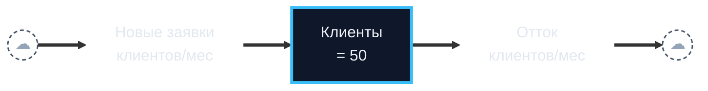
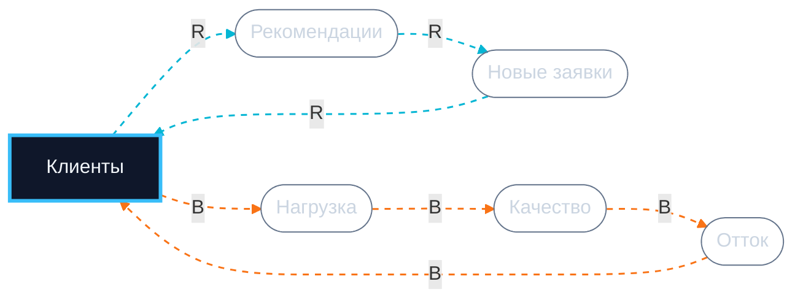
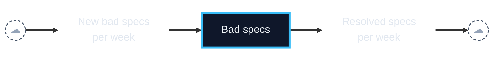
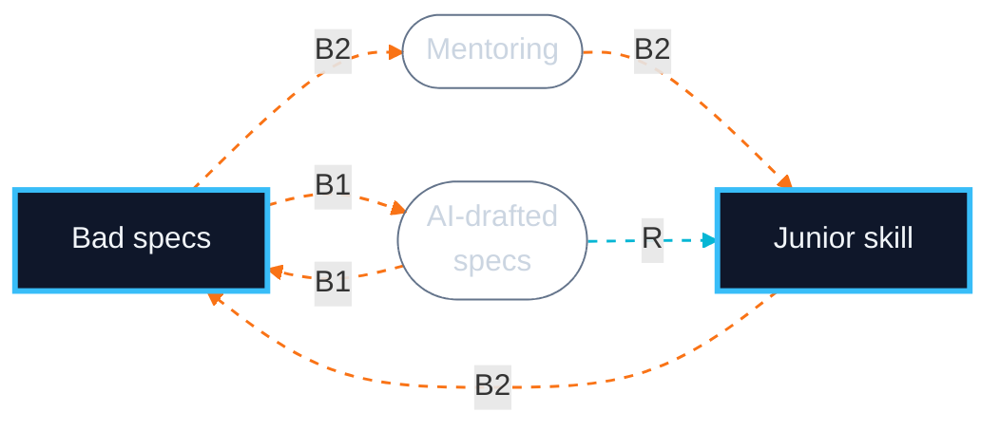
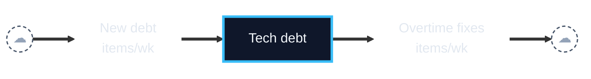

# Mermaid Cheatsheet — Two-block SFD + CLD

This file is INLINED into PROMPT.md. Edit here, then sync into the prompt's `<<<MERMAID_RULES>>>` block.

## Goal

Output **two Mermaid blocks** in §7, mirroring how SD textbooks teach:
1. **SFD (Stock-and-Flow Diagram)** — the pipe: cloud → inflow rate → stock → outflow rate → cloud. Always horizontal.
2. **CLD (Causal Loop Diagram)** — the loops + auxiliaries. Closes back to the stock.

Each block stays small and renders cleanly. Together they communicate the full structure.

## Why two blocks

Mermaid (any engine — dagre or ELK) cannot reliably keep a horizontal pipe AND place secondary loop pills above/below the stock. Layout always degrades. Splitting them lets the SFD stay clean and the CLD be a proper causal diagram with auxiliaries.

## Block 1 — SFD (pipe only)

- Use `flowchart LR`.
- **Source/Sink (cloud)** = `Src(("☁")):::cloud`, `Snk(("☁")):::cloud`.
- **Stock** = sharp rectangle, thick border: `S["Customers<br/>= 50"]:::stock`. **No** `**bold**` markdown.
- **Flow (rate label on the pipe)** = `In["New customers<br/>per month"]:::rate`. Transparent fill and stroke; the rate label sits ON the thick arrow.
- **Material flow** = thick `==>` along the entire pipe.
- **Do NOT** put auxiliaries or loop pills here.

## Block 2 — CLD (loops + auxiliaries)

- Use `flowchart LR`.
- **Stock** = same `:::stock` class as in Block 1.
- **Auxiliaries** (recommendations, load, quality, AND inflow/outflow rates as variables): stadium `A(["Name"]):::aux`.
- **Causal links** = thin dashed `-.->` colored by loop. Edge label `R` or `B`.
- Each loop closes back to the stock.
- Optional polarity: append `(+)` or `(−)` to edge labels only when polarity is non-obvious.
- ≤8 nodes per CLD block.

## Mandatory `classDef` (used by both blocks)

```
classDef stock fill:#0f172a,stroke:#38bdf8,stroke-width:3px,color:#f1f5f9
classDef cloud fill:transparent,stroke:#475569,stroke-width:1.5px,stroke-dasharray:4 3,color:#94a3b8
classDef rate fill:transparent,stroke:transparent,color:#e2e8f0
classDef aux fill:transparent,stroke:#64748b,stroke-width:1px,color:#cbd5e1
```

R-loop edges: `linkStyle N,M,K stroke:#06b6d4,stroke-width:1.5px,stroke-dasharray:5 5`
B-loop edges: `linkStyle N,M,K stroke:#f97316,stroke-width:1.5px,stroke-dasharray:5 5`

Russian or other non-Latin labels are fine. Use `<br/>` for line breaks. Edge indices are 0-based per block.

## Worked example 1 — Limits to Growth (Stanislav)

**SFD:**



**CLD (R: word-of-mouth, B: capacity):**



## Worked example 2 — Shifting the Burden

Two stocks (symptom + capability) — the SFD is two pipes. Often you can show just the symptom-stock pipe, then put both solution loops + the atrophy R-loop in the CLD.

**SFD (symptom only):**



**CLD (B1 quick fix, B2 fundamental, R atrophy):**



## Worked example 3 — Fixes that Fail

**SFD:**



**CLD (B short-term fix, R unintended consequence):**


## What NOT to do

- Don't use `**bold**` markdown inside node labels — Mermaid does not parse it; you'll get literal asterisks.
- Don't omit the `classDef` block; without it the colors don't render.
- Don't put auxiliaries or loop pills in the SFD block — that pulls the pipe off horizontal. Auxiliaries belong in the CLD only.
- Don't try `flowchart TB` or subgraph layout tricks — they degrade the pipe under default Mermaid renderers.
- Don't invent variables the user did not name — the CLD traces through what they named, no more.
- Don't number `linkStyle` based on the markdown order across both blocks — each block has its own 0-indexed edge numbering.
