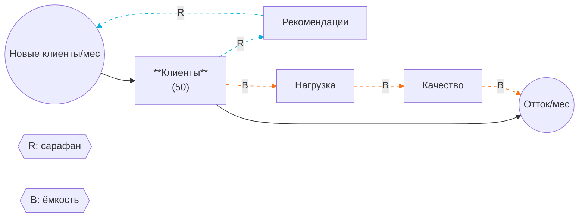
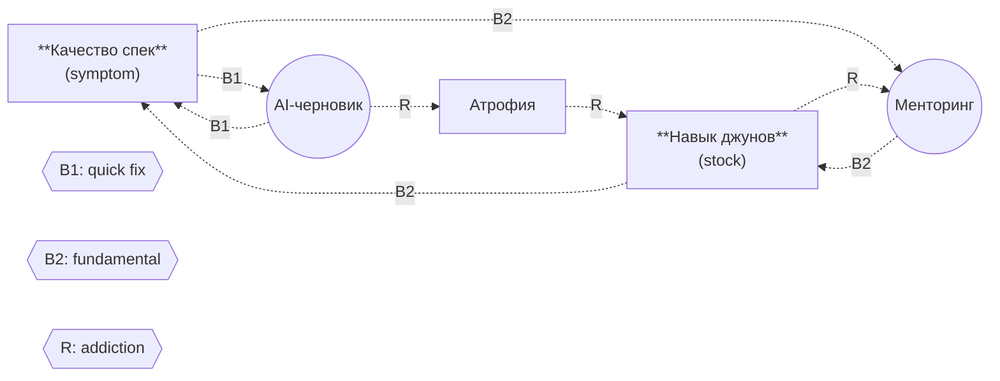

# Test Cases - Systems Coach Skill

Three cases that exercise the skill's main paths: a textbook archetype, a subtler archetype, and a refusal. Use these to validate the skill before W2 and to demo the failure modes during W2.

---

## Test Case 1 - Stanislav (textbook Limits to Growth)

### Input

```
Stock: клиенты бухкомпании (50 клиентов)
Inflow: новые клиенты через сарафан (клиентов/мес)
Outflow: отток из-за падения качества (клиентов/мес)
R-петля: клиенты → рекомендации → новые клиенты (текущие клиенты рекомендуют, привлекая новых)
B-петля: клиенты → нагрузка на сотрудников → качество → отток (рост базы перегружает сотрудников, качество падает, клиенты уходят)
Задержки: найм новых сотрудников ~3 мес.
Гипотеза: Limits to Growth
```

### Expected outputs

**1. Validation:** stock and flows pass. One critical question: is "сарафан" a function of stock (count) or flow (rate)? This changes dynamics.

**2. Assumptions (3-5):** linear quality drop vs. threshold; word-of-mouth independent of quality (vs. anti-word-of-mouth); capacity as constant vs. expandable; uniform per-customer referrals vs. 80/20; no competition.

**3. Archetype: Limits to Growth, high confidence.** R dominates first 4-6 mo, then B catches up. Growth and Underinvestment ruled out (constraint is people, not under-funded resource). Shifting the Burden ruled out (no quick-fix vs. fundamental). Fixes that Fail ruled out (no fix-loop with unintended R).

**4. Leverage:** parameter (marketing, weak) → structure (onboarding) → delay (proactive hiring at >70% load, strong) → goal (LTV/employee, strongest) → paradigm (productize away from B). Strongest = goal.

**5. Trajectory (12 mo):** reactive hiring → growth to ~80 by mo 5 → inflection mo 6 → plateau 70-80 by mo 12 + NPS dip. Proactive hiring → smooth growth to 95-110.

**6. Simulation prep:** stocks Клиенты=50, Сотрудники=5; flow formulas symbolic; auxiliaries Нагрузка, Качество; parameters to estimate: коэф_сарафана 5-15%/quarter, порог нагрузки 8-15 клиентов/сотрудник, задержка найма 2-4 mo, насыщенность 10-30%; horizon 24 mo, step 1 mo.

### Expected Mermaid (key snippet)



(plus classDef block at top)

### Pushback expected

- AI must NOT invent additional stocks (e.g., "доход", "репутация") that user did not name.
- AI must NOT identify Growth and Underinvestment as the answer - that requires constraint to be an under-resourced asset, not capacity.
- If AI rates confidence "low" - that's a fail; the structure is textbook.

---

## Test Case 2 - Shifting the Burden (AI drafts specs, junior skill atrophies)

### Input

```
Stock: качество спек (symptom, низкое сейчас)
Stock: навык джунов писать спеки (атрофируется)
Inflow B1 (quick fix): черновик спеки от AI → качество спек растёт (быстро)
Inflow B2 (fundamental): менторинг джунов → навык джунов растёт → качество спек растёт (медленно, дорого)
R (side-effect): использование AI-черновиков → джуны меньше пишут руками → навык джунов падает → ещё больше зависимости от AI
Задержки: атрофия навыка ~3-6 мес; восстановление через менторинг ~6-12 мес
Гипотеза: Shifting the Burden
```

### Expected outputs

**1. Validation:** "качество спек" - валидный stock (можно измерять, накапливается во времени, единица - условные баллы или %). "Навык джунов" - валидный stock. "Черновик спеки от AI" как inflow - формально не поток качества, а событие/практика, которая *модулирует* приток. Подумай: правильнее назвать поток "темп улучшения качества через AI-драфт" в единицах баллов/мес.

**2. Assumptions (3-5):**
- Допущение: AI-драфт всегда улучшает качество. Реальность: при атрофии навыка джуны не могут *оценить* качество AI-драфта - могут принять плохое за хорошее.
- Допущение: атрофия линейная. Реальность: пороговая - до 6 мес почти не заметна, потом резко проявляется в новых задачах.
- Допущение: менторинг конвертируется в навык. Реальность: только если есть практика без AI-костылей одновременно.
- Допущение: качество спек = единственный симптом. Реальность: атрофия даёт каскадные симптомы (плохие тех-задачи, плохие code reviews).
- Допущение: B1 и B2 независимы. Реальность: B1 потребляет attention/budget, который мог пойти на B2.

**3. Archetype: Shifting the Burden, confidence high.** Symptom = низкое качество спек. Quick fix B1 = AI-драфт. Fundamental B2 = менторинг джунов → навык. Side-effect R = AI-драфт → атрофия навыка → ещё больше нужды в AI. Канонический паттерн: B1 быстро снимает симптом, R незаметно убивает способность применить B2.
Limits to Growth - не похоже (нет роста stock через R, есть деградация другого stock). Fixes that Fail - частично (fix имеет непреднамеренное последствие), но в Shifting the Burden есть явная *альтернатива* (B2), которой здесь нет в FtF.

**4. Leverage:**
- Параметр (слабо): доля AI-драфтов 100% → 70%.
- Структура: ввести правило "первый драфт всегда руками, AI - только для критики".
- Задержка: организовать ранние сигналы атрофии (тест-задачи без AI раз в квартал).
- Правила: явный контур "если AI-зависимость > X%, обязательное менторинг-время".
- Цели (сильнее всего): переопредели цель команды с "скорость спек" на "автономность джунов". Снимает давление на B1.
- Парадигма: AI как тренажёр (force-multiplier для развивающегося навыка) vs. AI как костыль (заместитель навыка).

**5. Trajectory (12 mo):** мес. 1-3: качество спек растёт (B1 работает), все довольны. Мес. 4-6: первая обжига - джун не может написать спеку без AI на новом проекте. Мес. 7-9: senior начинают замечать "странные" спеки от джунов (правильные по форме, бессмысленные по сути). Мес. 10-12: либо менеджмент включает B2 ценой -30% скорости, либо качество и навык оба деградируют, образуется зависимость от AI.

**6. Simulation prep:** stocks Качество=30, Навык=70 (нач. условные %); B1 поток = AI_доля × коэф_лифта; B2 поток = менторинг_часы × коэф_конверсии × Навык; R: AI_доля → -Навык/мес; параметры: коэф_лифта (0.1-0.5/мес?), коэф_конверсии (0.05-0.2?), скорость атрофии (1-5%/мес от текущего?), AI_доля (0-100%, контролируется); горизонт 24 мес, шаг 1 мес.

### Expected Mermaid (key snippet)



(plus classDef + linkStyle for B1=0,1; B2=2,3,4 orange; R=5,6,7 cyan)

### Pushback expected

- AI must NOT call this Limits to Growth (common mistake - any 2-loop structure pattern-matches there).
- AI must explicitly contrast Shifting the Burden vs. Fixes that Fail and explain why this is StB (presence of fundamental alternative B2).
- If AI labels the R-loop as "balancing" because individual edges are negative - that's a fail. R/B is determined by whether the loop *amplifies* or *dampens*, not by individual edge signs.

---

## Test Case 3 - Malformed input (refusal)

### Input

```
У меня бухкомпания, всё время не успеваю, сотрудники выгорают, клиенты жалуются на качество, не понимаю что делать. Помоги построить модель и подсказать, что я должен сделать.
```

### Expected output (refusal)

```
Чтобы разобрать диаграмму, мне нужно как минимум:

(1) название stock и его единицы (например, "клиенты, шт")
(2) хотя бы один inflow или outflow с единицей stock/время (например, "новые клиенты/мес")
(3) хотя бы одна петля обратной связи (R или B) словами (например, "клиенты → нагрузка → качество → отток")

Сейчас не хватает: stock-имени и единиц, явных flows, и петель обратной связи. У тебя в описании есть наброски: "клиенты", "сотрудники", "качество", "выгорание" - но не указано, что из этого накапливается (stock), а что движется (flow), и как они влияют друг на друга через циклы.

Нарисуй диаграмму от руки сначала. Это не формальность - рисование руками и есть акт мышления, на котором держится вся работа W2. AI на этом этапе только паразитирует.

Когда нарисуешь, пришли структурированный вход по шаблону:
- Stock: <имя> (<нач. значение>, <единица>)
- Inflow: <имя> (<единица: stock/время>)
- Outflow: <имя>
- R: <переменная> → <переменная> → <переменная>
- B: <переменная> → <переменная> → <переменная>

Я разберу.
```

### Pushback expected

- AI must NOT start guessing stocks/flows from the prose ("звучит как Limits to Growth, давай я нарисую тебе...") - that's the failure mode we're testing against.
- AI must NOT give generic systems thinking advice ("подумай о feedback loops...") without the refusal first. The refusal is the teaching moment.
- AI must give a concrete template, not just "пришли структурированный вход".
- If the AI's refusal is longer than the analysis - that's a fail. Refusal should be ~150-200 words, with a fillable template.

---

## How to validate before workshop

1. Paste PROMPT.md into ChatGPT (free tier) - run all 3 test cases. Observe: does it pass test 3 (refusal) without first analyzing? This is the highest-risk path.
2. Paste into Claude.ai - run test 1, verify Mermaid renders in artifact with cyan R-edges and orange B-edges.
3. Run test 2 in Claude Sonnet vs. Opus - compare archetype calibration. If Sonnet calls Shifting the Burden "Limits to Growth", note for participant warning.
4. Run test 1 a second time and ask "теперь нарисуй мне другой вариант моей бухкомпании". Verify hard refusal.
